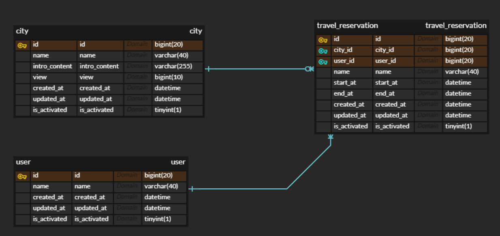
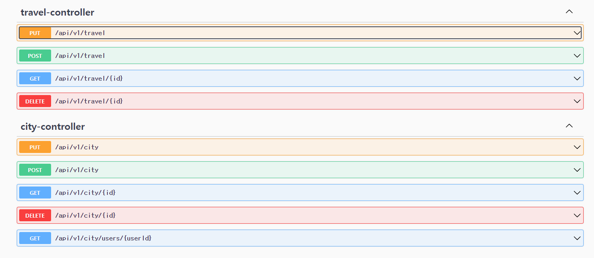
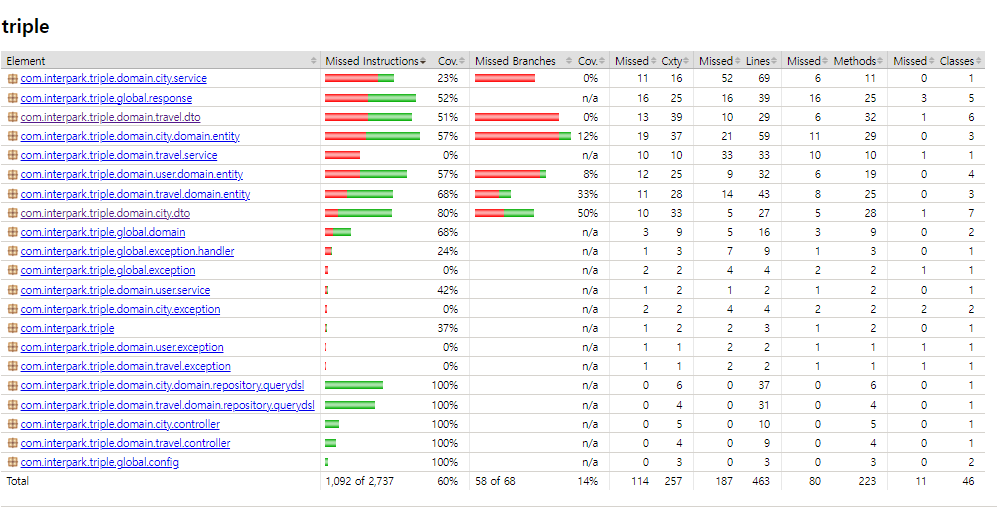

[Database ERD]

[RESTDocs 로 구현된 API 명세](src/docs/asciidoc/index.html)

[TODO List](src/docs/TodoList.md)

로컬 실행 후 사용 가능
[Swagger-UI](http://localhost:8080/swagger-ui/index.html)

아쉬운점

세밀한 단위 테스트
